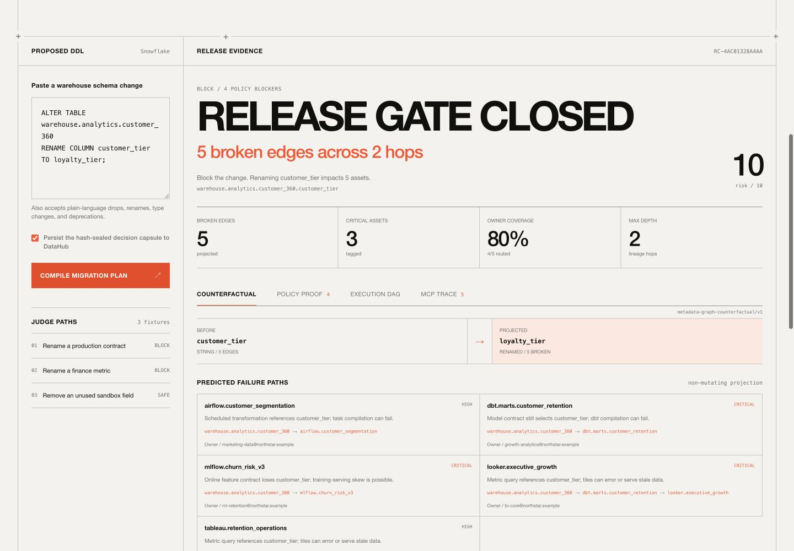
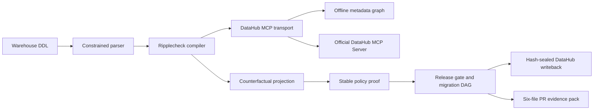

# Ripplecheck

[](https://github.com/sohamkamat28/ripplecheck/actions/workflows/test.yml)
[](LICENSE)
[](https://www.python.org/)

Ripplecheck is a **counterfactual schema migration compiler** powered by the DataHub MCP tool contract. Paste breaking warehouse DDL and it projects the metadata graph, proves a bounded release policy, routes an executable migration DAG to owners, writes a hash-sealed decision capsule back to DataHub, and generates a merge-ready PR evidence pack.

It runs with **no API key, no paid billing, no network, and no Python dependencies**. A synthetic DataHub snapshot makes the judge path deterministic and fully offline. Live mode swaps in the official DataHub MCP Server without changing the orchestration path.



**Hackathon category:** Agents That Do Real Work

**Why:** Ripplecheck does more than retrieve or summarize metadata. It makes a release decision, compiles owner-assigned migration work and code artifacts, and persists the result for the next engineer or agent.

## Run the judge path

```bash
python3 main.py web --host 127.0.0.1 --port 8000
```

Open [http://127.0.0.1:8000](http://127.0.0.1:8000), leave the default DDL unchanged, and click **Compile migration plan**.

```sql
ALTER TABLE warehouse.analytics.customer_360
RENAME COLUMN customer_tier TO loyalty_tier;
```

Expected output:

- release gate `CLOSED` with risk `10/10`;
- 5 broken lineage edges across a dbt model, Airflow flow, ML model, and 2 dashboards;
- 4 failed policy rules, 1 ownership warning, and 80% owner coverage;
- exact source-to-consumer lineage paths through 2 hops;
- a 10-node zero-downtime execution DAG from freeze gate `G0` to retirement approval `G1`;
- an exact 5-call DataHub MCP trace and hash-sealed writeback;
- a downloadable 6-file PR pack containing compatibility SQL, dbt contract YAML, a parity test, review evidence, owner routing, and a hash-addressed change capsule.

For recording, use the [exact click-and-say demo runbook](docs/DEMO_RUNBOOK.md). It includes every click, screen state, narration line, timing, recovery step, architecture answer, and the requested tech-stack table in one document.

Judges can use the dedicated [testing instructions](docs/TESTING.md), inspect the extracted [generated examples](examples/), and review the [project disclosures](docs/DISCLOSURES.md).

## Why this is not a generic blast-radius bot

A blast-radius bot ends with a list. Ripplecheck compiles a controlled migration:

1. **Parse real DDL.** Snowflake `ALTER TABLE` renames, drops, and type changes are accepted alongside natural language.
2. **Ground the change.** `search` and `list_schema_fields` resolve the exact DataHub entity, field, type, tags, and description.
3. **Project the after-state.** `get_lineage` and `get_entities` produce exact paths, predicted failure modes, ownership coverage, critical consumers, and hop depth without executing DDL.
4. **Prove policy.** Stable rules `RC-001` through `RC-044` return `PASS`, `WARN`, or `FAIL` with evidence and a measurable gate-open condition.
5. **Compile work.** The execution DAG sequences freeze, expand, compatibility, consumer migrations, convergence proof, and human-approved retirement.
6. **Create the handoff.** A deterministic ZIP contains code, tests, decision evidence, owner routing, and SHA-256 provenance.
7. **Persist memory.** `update_description` appends the capsule, evidence hash, blockers, affected URNs, and owners to the source column.

The release authority is deterministic. A model can later broaden request parsing or propose remediation, but it cannot silently override graph evidence or policy.

## DataHub MCP flow

| Call | Evidence loaded | Used by the compiler |
| --- | --- | --- |
| `search` | Exact source entity and URN | Dataset resolution |
| `list_schema_fields` | Field type, documentation, and governance tags | Before-state and governed-field proof |
| `get_lineage` | Column-level downstream graph through 3 hops | Broken edges and exact failure paths |
| `get_entities` | Owners, asset types, domains, platforms, and criticality | Owner routing, ML protection, coverage, and risk |
| `update_description` | Mutation result | Hash-sealed, durable decision capsule |

Offline mode implements these official names over `data/catalog.json`. Live mode speaks MCP JSON-RPC over stdio to the official server. Live errors never fall back silently to fixtures.

## Architecture



See [docs/ARCHITECTURE.md](docs/ARCHITECTURE.md) for the transport boundary, capsule schema, policies, and safety properties.

## Run modes

### Web demo

```bash
python3 main.py web
```

Endpoints:

- `GET /health`
- `GET /api/scenarios`
- `POST /api/analyze`
- `GET /api/evidence-pack/<run_id>`

### CLI

```bash
python3 main.py assess \
  "ALTER TABLE warehouse.analytics.customer_360 RENAME COLUMN customer_tier TO loyalty_tier;"
```

Use `--no-writeback` for a read-only run.

### MCP server

Ripplecheck is itself an MCP stdio server:

- `assess_schema_change`
- `list_demo_scenarios`

```bash
python3 main.py mcp
```

Copy `.mcp.json.example` and replace its repository path to use it from an MCP-compatible client.

### Live DataHub

Initialize the official server against DataHub OSS or DataHub Cloud, then select the live transport:

```bash
npx -y @acryldata/mcp-server-datahub init
export RIPPLECHECK_MODE=live
export DATAHUB_MCP_COMMAND="npx -y @acryldata/mcp-server-datahub"
export TOOLS_IS_MUTATION_ENABLED=true
python3 main.py web
```

Mutation tools are opt-in. Clear `TOOLS_IS_MUTATION_ENABLED` and uncheck writeback for a read-only live assessment.

## Demo scenarios

| Proposed change | Expected | Distinct proof |
| --- | --- | --- |
| Rename `customer_tier` to `loyalty_tier` | BLOCK | Five consumers, production ML risk, one ownership gap, generated compatibility pack |
| Rename finance `net_revenue` | BLOCK | Critical executive finance dashboard and accountable finance owner |
| Drop unused sandbox `legacy_bucket` | SAFE | No downstream consumer edge, open gate, normal contract validation |

Checked-in deterministic outputs:

- [Production contract rename](samples/customer-tier-rename.json)
- [Finance metric rename](samples/revenue-rename.json)
- [Safe sandbox cleanup](samples/safe-sandbox-drop.json)

Regenerate through the real compiler path:

```bash
make samples
```

Fixture names and email addresses are synthetic. All addresses use the reserved `.example` domain. Offline writebacks are saved to the gitignored `data/run-state.json` and reapplied for the current server.

## Generated PR pack

The default ZIP is generated in memory and contains:

```text
migration/compatibility_view.sql
models/customer_360/schema.yml
tests/assert_customer_tier_compatibility.sql
review/ripplecheck-decision.md
review/owner-routing.json
manifest/change-capsule.json
```

The ZIP is byte-for-byte deterministic for the same assessment. Its fixed timestamps and canonical JSON make review diffs stable.

## Verify

```bash
make samples
make verify
```

Verification covers parsing, decisions, graph paths, policy rules, execution gates, durable writeback, MCP handshake, deterministic ZIP bytes, ZIP members, generated SQL, Python compilation, required files, sample shape, and public-copy checks. GitHub Actions runs the same path.

## Deploy

### Docker

```bash
docker build -t ripplecheck .
docker run --rm -p 8000:8000 ripplecheck
```

### Render Blueprint

Push the repository publicly, create a Render Blueprint from it, and use the generated `onrender.com` URL. `render.yaml` selects the free web plan, fixture mode, the native Python runtime, and `/health`; no secret is required.

## Submission package

- [One-document demo runbook and tech stack](docs/DEMO_RUNBOOK.md)
- [Devpost copy](docs/DEVPOST.md)
- [Architecture](docs/ARCHITECTURE.md)
- [Deadline-focused checklist](docs/SUBMISSION_CHECKLIST.md)
- [Checked-in sample outputs](samples/)
- [Extracted generated artifacts](examples/)
- [Judge testing instructions](docs/TESTING.md)
- [Official-rules compliance matrix](docs/RULES_COMPLIANCE.md)
- [Project disclosures](docs/DISCLOSURES.md)
- [Apache License 2.0](LICENSE)

The deadline is **August 10, 2026 at 5:00 PM EDT**, or **August 11 at 2:30 AM IST**. The submission checklist targets an earlier upload window.

## Scope and honesty

- Fixture mode is a deterministic metadata snapshot, not a DataHub Cloud connection.
- Live mode invokes the official DataHub MCP Server and uses its real results.
- Ripplecheck never executes the submitted DDL.
- Generated SQL and contracts are review artifacts, not automatically applied changes.
- The risk score is an explainable bounded score, not a probability.
- The default path uses no LLM, OpenAI API key, or paid service.

## License

Apache License 2.0. See [LICENSE](LICENSE).

For security reports and supported judge-testing dates, see [SECURITY.md](SECURITY.md).
